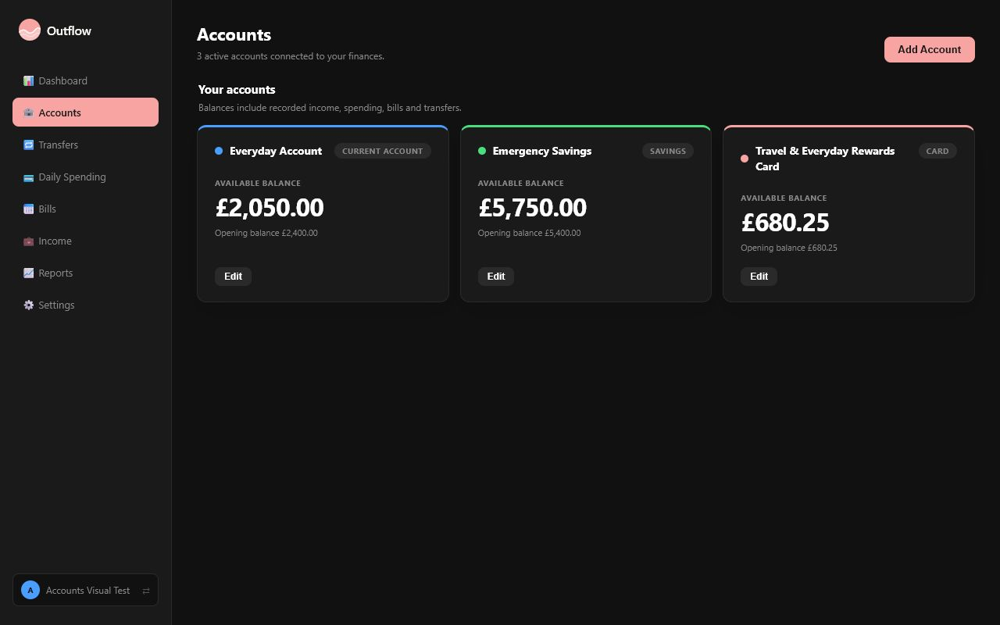
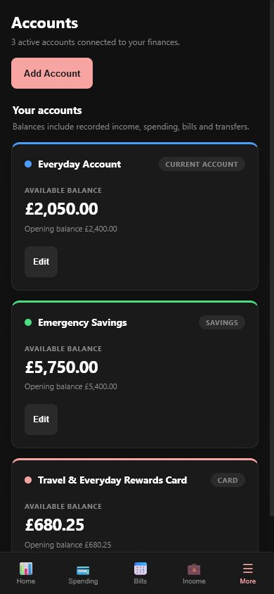

# Outflow

Outflow is a responsive, self-hosted personal finance tracker for households that want to keep their financial data on infrastructure they control. It tracks income, daily spending, recurring bills, accounts, transfers, and trends in one accessible web interface.

> **Version 1 release baseline:** package version 2.3.0. The package version remains on the repository's existing semantic-version sequence; it has not been reset for this production-readiness milestone.

## Screenshots

| Desktop account overview | Mobile account overview |
| --- | --- |
|  |  |

The screenshots use synthetic Playwright fixture data and contain no production financial information.

## Features

- Responsive Dashboard with configurable financial summaries, charts, calendars, and account balances.
- Daily Spending workflow with category and account filtering, grouped transactions, and inline editing.
- Shared recurring schedules for Bills, Income, Spending transactions, and account Transfers.
- Multiple accounts, transfers, categories, themes, and user profiles.
- Reports with category analysis and month-to-month comparisons.
- Administrator-controlled user management, updates, backup export, restore, and whole-instance maintenance.
- Per-user data ownership and clear-data controls for authenticated users.
- Automatic, transactional SQLite migrations with non-overwriting legacy migration backups.
- Keyboard-accessible navigation, dialogs, forms, and responsive touch targets.

## Architecture

Outflow is deliberately small and framework-free:

- **Runtime:** Node.js 20+, Express 4, and synchronous SQLite access through `better-sqlite3`.
- **Frontend:** a static HTML shell, shared CSS design system, Chart.js, and vanilla JavaScript feature modules.
- **Authentication:** cookie-based sessions with backend authorization and per-user ownership enforcement.
- **Persistence:** production uses `/var/lib/outflow/outflow.db`; development retains `data/fintrack.db`. Tests use isolated temporary databases through `FINTRACK_DB_PATH`.
- **Migrations:** `db-migrations.js` applies versioned, transactional migrations before the HTTP listener accepts requests.
- **Testing:** Node-based unit/API suites plus Playwright browser coverage.

### Module structure

```text
lib/                 Shared backend ownership and security-audit helpers
middleware/          Authentication and administrator authorization
routes/              Express API route modules
public/
  src/
    accounts/        Account page controller and rendering
    bills/           Bill page controller and rendering
    core/            API, authentication, and theme lifecycle
    dashboard/       Dashboard widgets, charts, and layout lifecycle
    income/          Income and recurring schedule workflows
    navigation/      Desktop and mobile navigation
    reports/         Report charts, filters, and tables
    settings/        Preferences and administrator tools
    shared/          Shared rendering, modal, chart, and user helpers
    spending/        Daily transaction workflows
    transfers/       Transfer workflows
    utils/           DOM and formatting utilities
tests/               Unit, API, migration, and Playwright test suites
docs/                Design, migration, and release documentation
scripts/             Repository-native verification utilities
```

`public/app.js` remains a compatibility entry point and loads the modular frontend from `public/src/bootstrap.js`.

## Installation

### Requirements

- Node.js 20 or later
- npm
- Linux, macOS, or Windows for manual installation
- Proxmox VE 7+ only when using the automated LXC installer

### Development installation

```bash
git clone https://github.com/CtrlAltcouk/fintrack.git
cd fintrack
npm ci --omit=dev
npm start
```

This checkout-local startup is intended for development or evaluation. Open `http://localhost:3000`; when no users exist, Outflow prompts for the first administrator account.

For production on Debian 12, use `setup.sh` with a pinned semantic-version tag or full commit SHA. For a new Proxmox LXC deployment, run `install.sh <container-id> <pinned-release>` from the Proxmox host. Both scripts refuse an existing or legacy deployment instead of replacing it. Review scripts before running them with root privileges.

### Production filesystem layout

```text
/opt/outflow/app                 Active release symlink (replaceable code)
/opt/outflow/releases/           Immutable versioned releases
/var/lib/outflow/outflow.db      Persistent SQLite database
/var/lib/outflow/backups/        Non-overwriting deployment backups
/etc/outflow/outflow.env         Root-controlled runtime configuration
/var/log/outflow/                Optional application-owned file logs
```

The `outflow` system account runs the service. Persistent data is never stored beneath `/opt/outflow`. Re-running `setup.sh` exits without changing code, data, configuration, backups, or logs. Never place `OUTFLOW_DB_PATH` or legacy `FINTRACK_DB_PATH` inside a Git checkout or release directory.

## Development

```bash
npm ci
npm run dev
```

The development server uses Node's watch mode and listens on port 3000 by default. Set `PORT` to use another port. `OUTFLOW_DB_PATH` is the preferred production setting; `FINTRACK_DB_PATH` remains a backwards-compatible alias for tests and legacy deployments. Production refuses an absent path, conflicting aliases, or a path beneath replaceable application code.

Operational recurrence-runner configuration and diagnostics are documented in [docs/recurrence-runner.md](docs/recurrence-runner.md).

`NODE_ENV` must be `development`, `test`, or `production`. `PORT` must be an integer from 1 to 65535 in production (port `0` is accepted only for isolated test/development processes). Invalid runtime configuration stops startup before the database is opened.

### Session configuration

Outflow issues opaque 256-bit session credentials and stores only a domain-separated SHA-256 digest with UTC creation and expiry timestamps. Sessions expire after 12 hours by default. Set `OUTFLOW_SESSION_TTL_HOURS` to a positive value no greater than 720; invalid values stop startup before the database is opened.

Production cookies are `HttpOnly`, `Secure`, `SameSite=Lax`, limited to `Path=/`, and expire with the server-side session. Development keeps the same attributes except `Secure`, allowing localhost HTTP. When TLS terminates at a controlled reverse proxy, set `OUTFLOW_TRUST_PROXY_HOPS` to the exact known hop count (maximum 16). The default is zero and forwarded headers are not trusted.

Persisted account and client-IP throttling protects login without revealing whether a display name exists. Defaults are 5 failures per account in 5 minutes, 10 in 15 minutes, and 30 per IP in 15 minutes, with progressive temporary cooldowns capped at one hour. Configuration, proxy identity rules, lifecycle, and backup behavior are documented in [docs/login-security.md](docs/login-security.md).

## Testing and verification

Financial input, restore, and migration policies are documented in [docs/financial-validation.md](docs/financial-validation.md).

```bash
npm run lint          # syntax-check all repository JavaScript
npm run test:unit     # unit, migration, and API tests
npm run test:e2e      # Playwright browser tests
npm run check         # unit/API tests followed by Playwright
npm run verify        # syntax check plus the complete test suite
npm run release-check # production dependency audit, verify, and diff check
```

The GitHub Actions verification workflow performs a clean `npm ci`, installs the pinned Playwright browser, and runs the same release check on pull requests, `main`, and version tags. The lockfile is the reproducible dependency source; release deployments use `npm ci`, never an unconstrained install.

Playwright browser binaries must be installed once on a development machine:

```bash
npx playwright install chromium
```

## Production deployment

1. Deploy a pinned release through `setup.sh` or the documented release process.
2. Keep application code root-owned and persistent directories writable only by the `outflow` service account.
3. Run the supplied `outflow.service` systemd unit; do not run the application as root.
4. Put Outflow behind a trusted HTTPS reverse proxy when it is reachable beyond a private network.
5. Back up the database before every upgrade and regularly export an administrator backup from Settings.
6. Monitor `GET /api/health` for process liveness and `GET /api/ready` for database/schema readiness. Only route user traffic after readiness returns HTTP 200.
7. Verify login, Dashboard data, and a read-only report after deployment before declaring the release healthy.

The service handles `SIGTERM` and `SIGINT` by stopping new HTTP work, stopping the recurrence runner, and then closing SQLite. The supplied systemd unit allows 30 seconds for this drain before supervision intervenes.

The supported production target for this release is Debian 12 under systemd, including a Debian 12 Proxmox LXC. A maintained Docker image or Compose definition is not supplied; containerising Outflow requires an operator-owned persistent volume, init/signal forwarding, health checks, HTTPS proxying, and a tested SQLite backup/rollback procedure. Treat an official Docker distribution as post-release work rather than improvising it for this candidate.

Legacy PM2 deployments under `/opt/fintrack` are not modified automatically. Follow the backed-up migration procedure in [RELEASE.md](RELEASE.md); do not run the first-install script over them.

## Upgrades and rollback

Before upgrading, export an administrator backup, stop write traffic, and preserve the current SQLite database. Then update the source, run `npm ci --omit=dev`, and restart the service. Database migrations run automatically at startup and are transactional.

Detailed first-start, backup, restore, upgrade, rollback, and administrator instructions are in [RELEASE.md](RELEASE.md). Migration-specific behaviour is documented in [docs/migrations.md](docs/migrations.md).

## Security and data ownership

Outflow is designed for trusted self-hosting. Administrator operations are enforced by the backend, API errors are normalized, request sizes are bounded, and audit events omit credentials, request bodies, financial values, and unnecessary personal data. Backup exports intentionally contain no live session token or token digest, and every successful restore logs out all users. Operators remain responsible for host patching, TLS, filesystem permissions, and off-host backups.

## License

No open-source license has been granted. The package is marked `UNLICENSED` and private to prevent accidental npm publication.
